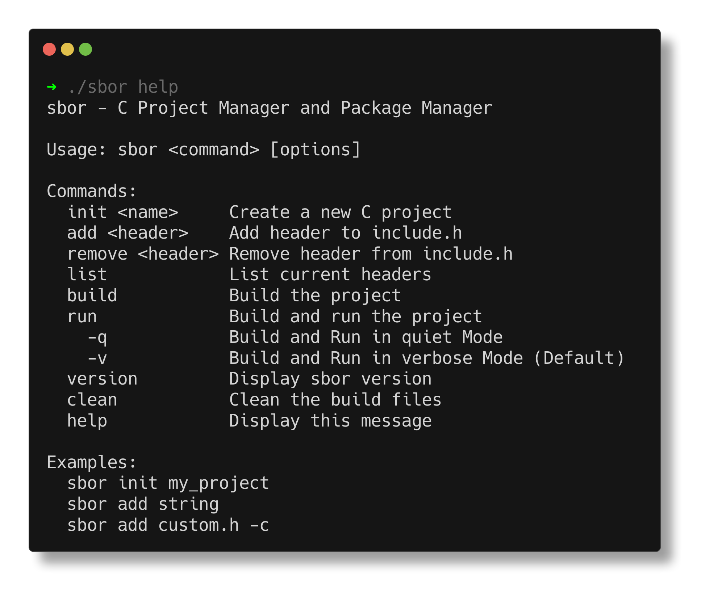

# Sbor

`sbor` is a  project manager for C


## Functionalities (Not yet created)

1. `sbor init` : Initializes a new C project  (**Created**)
2. `sbor add` : Adds a new dependency (No need to add `#include` in main.c file, this will do it automatically)
3. `sbor remove` : Removes a dependency
4. `sbor build` : Builds the project and creates a new binary (**Created**)
5. `sbor run` : Builds and runs the project (**Completed**)

The dependencies are listed a configuration file (`sbor.conf`) which also contains the project metadata.

Since the dependencies have to be imported , they are also included in a separate `include.h` file which is included into the `main.c` file.

## Commands List




## Installation and Running

### From Source

```bash
# Run cmake to generate the Makefile
cmake .

# Run make to generate the binary
make

# Run the binary
./sbor version
```

### Using Homebrew

```bash
brew install Vaishnav-Sabari-Girish/taps/sbor

# Then Run

sbor version
```

## Goals

### Project Manager

- [x] Initialize a project using `sbor init`
- [ ] Add dependencies using `sbor add`
- [x] Build the project using `sbor build`
- [ ] Remove a dependency using `sbor remove`
- [x] Run the project using `sbor run`


## Recordings 

### Initializing a project


### Building a project


### Running the project

#### Verbose Mode (Default)


#### Quiet Mode


